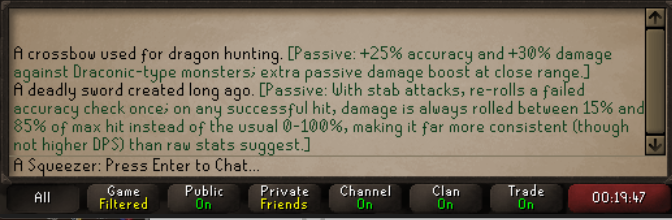

<p align="center">
  
</p>

<p align="center">
  <a href="https://runelite.net/plugin-hub/show/better-item-examine">
    
  </a>
  <a href="https://runelite.net/plugin-hub/show/better-item-examine">
    
  </a>
  <a href="LICENSE">
    
  </a>
</p>

Old School RuneScape is full of gear with real combat effects that the game never tells you
about - the Twisted bow's Magic-scaling accuracy, the Dragon hunter lance's Draconic bonus, a
full Barrows set's proc-based heal. **Better Item Examine** fills in the gap: examine an item
and, if it has a hidden or passive effect, the plugin appends it right onto the examine text.

## Features

- Appends hidden/passive effect text onto the item's normal examine message
- Covers weapons, armour, jewellery, and ammunition - hundreds of items and counting
- Configurable display: append to the examine line, or send as a separate chat message
- Optional colour highlighting so the added text stands out from the base examine text
- Can be filtered to equippable items only, if you don't want it triggering on things like
  charged jewellery or ammunition
- Every entry links back to its OSRS Wiki source, so you can read more if you want the details

## Configuration

| Setting | Description |
| --- | --- |
| **Append to examine text** | On: the passive effect is appended directly onto the item's examine chat line. Off: it's sent as its own separate game message. |
| **Highlight color** | The colour used to highlight the passive effect text in chat. |
| **Only equippable items** | On: only shows passive info for items you can wear/wield. Off: also covers non-wearable passive-effect items (e.g. certain rings, tools). |

## Installation

Better Item Examine is available on the RuneLite Plugin Hub. In the RuneLite client, open the
Plugin Hub (the plug icon in the sidebar), search for **Better Item Examine**, and install it.
See the [RuneLite wiki](https://github.com/runelite/runelite/wiki/Information-about-the-Plugin-Hub)
for more on installing Plugin Hub plugins in general.

## Contributing

The most valuable contribution to this plugin is **more items**. If you know an item with a
hidden effect that isn't covered yet, you don't need to touch any Java code - just add an
entry to the matching JSON file under
[`src/main/resources/com/betteritemexamine/data/`](src/main/resources/com/betteritemexamine/data/):

```json
{
  "name": "Item name",
  "itemIds": [12345, 67890],
  "description": "Short, factual description of what the passive actually does.",
  "wikiUrl": "https://oldschool.runescape.wiki/w/Item_name"
}
```

A few guidelines:

- Include every relevant item variant (charged/uncharged, broken/locked, ornament kits) -
  verify each ID against the item's own OSRS Wiki infobox, don't guess from memory.
- Only include effects that are **not** already shown on the item's stats/examine screen.
- Keep descriptions terse and factual, written for someone who already knows what the item is.
- Run `./gradlew test --tests "com.betteritemexamine.PassiveEffectDataValidationTest"` after
  editing - it checks for malformed JSON, missing fields, and item IDs claimed by two entries.

See [`docs/REPO_CONTEXT.md`](docs/REPO_CONTEXT.md) for a fuller tour of how the plugin is put
together, and [`docs/AGENTS.md`](docs/AGENTS.md) for general RuneLite plugin conventions used
in this repo.

## How it works

```text
MenuOptionClicked (Examine) --> stores item ID --> ChatMessage (ITEM_EXAMINE)
                                                   |
                                                   v
                             PassiveEffectRepository.getForItemId()
                                                   |
                                                   v
                                 appends passive effect text
```

- `BetterItemExaminePlugin` listens for the examine flow and wires everything together.
- `PassiveEffectRepository` loads every data file at startup into an itemId -> effect map.
- `PassiveEffect` is the data model: name, item IDs, description, wiki link.
- `BetterItemExamineConfig` exposes the settings listed above.

## License

Better Item Examine is licensed under the [BSD 2-Clause License](LICENSE).
