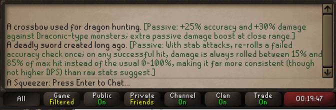
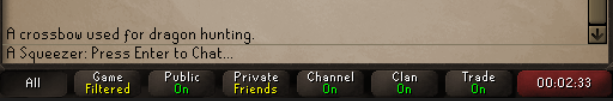
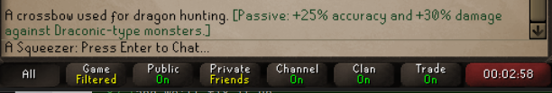

  

<h1 align="center">Better Item Examine</h1>

<b>Find out what your gear <i>actually</i> does - without alt-tabbing to the wiki.</b>

  
  

---

## 🤔 Wait, my bow does *what*?

Loads of OSRS items have secret superpowers the game never mentions. Your Twisted bow hits harder the more Magic a boss
has. Your Dragon hunter crossbow shreds dragons. Your Salve amulet quietly buffs you against the undead. None of that shows
up in the stats screen, and the examine text just tells you the item looks nice.

**Better Item Examine fixes that.** Right-click any item, hit **Examine**, and if it has a hidden effect, you'll see it
right there in your chatbox:

**😐 Without the plugin**

  

**🤩 With the plugin**

  

That's it. No overlays, no clutter, nothing to learn.

## ✨ What you get

- 🗡️ **130+ items and sets covered** - weapons, armour, jewellery, and ammo, with more added regularly
- 🛡️ **Set effects too** - Barrows, Void, Inquisitor's, Justiciar, Crystal, Moons, and more
- 💎 **Enchanted bolt procs** - finally remember what Opal vs. Pearl vs. Dragonstone bolts do
- 🎨 **Your colours** - pick whatever highlight colour you like so the effect pops out
- 🤫 **Stays out of the way** - only kicks in when *you* examine something

## 🚀 Getting started

1. Open RuneLite and click the **Plugin Hub** button (the plug icon) in the sidebar
2. Search for **Better Item Examine** and hit **Install**
3. Right-click a cool item in your inventory, bank, or equipment and choose **Examine**
4. Be enlightened ✨

## ⚙️ Settings

Find these by clicking the 🔧 wrench icon → **Better Item Examine**.

| Setting                    | What it does                                                                                                                      | Default    |
|----------------------------|-----------------------------------------------------------------------------------------------------------------------------------|------------|
| **Append to examine text** | Tacks the effect onto the end of the normal examine message. Turn it off to get the effect as its own separate chat line instead. | On         |
| **Highlight color**        | The colour of the hidden-effect text, so it stands out from the regular examine text.                                             | Light blue |
| **Only equippable items**  | Only show effects for things you can wear or wield.                                                                               | Off        |

## ❓ FAQ

**I examined an item and nothing extra showed up.**
Either it doesn't have a hidden effect, or we haven't added it yet! If you know of one we're missing, let us know (see
below).

**Where does this info come from?**
Every effect is researched from the [Old School RuneScape Wiki](https://oldschool.runescape.wiki/), and only effects
that *aren't* already shown in-game are included.

**Something looks wrong or out of date.**
Jagex changes things sometimes! Please [open an issue](https://github.com/jamescer/better-item-examine/issues)
and we'll fix it up.

**Does this break any rules?**
Nope. It only adds text to a chat message you already asked for - it doesn't click, play, or make any decisions for you.

## 💬 Missing an item? Found a bug?

[Open an issue on GitHub](https://github.com/jamescer/better-item-examine/issues) with the item name and what its effect
is (a wiki link is a huge help). Suggestions are always welcome!

Feeling handy? Adding an item is just a few lines of JSON - no coding required. Check out the
[contributor guide](docs/REPO_CONTEXT.md) to get started.

---

  Made with ❤️ for the OSRS community · <a href="LICENSE">BSD 2-Clause License</a>

